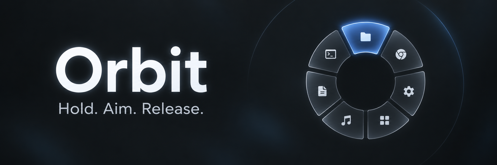

<p align="center">
  
</p>

<p align="center">
  <a href="CHANGELOG.md"></a>
  <a href="#project-status"></a>
  <a href="#requirements"></a>
  <a href="LICENSE"></a>
</p>

<p align="center">
  <a href="#quick-start">Quick start</a> &middot;
  <a href="#desktop-integration">Desktop integration</a> &middot;
  <a href="#configuration">Configuration</a> &middot;
  <a href="#contributing">Contributing</a>
</p>

Orbit brings the hold-and-release interaction of GTA V's weapon wheel to your
Linux desktop. Open applications, folders, websites, or commands from a
cursor-centered HUD with monochrome icons, translucent wedges, and subtle motion.

## Project status

> [!NOTE]
> Orbit is experimental. Development happens on `development`, with `v0.x.x`
> versions until the first stable release. Configuration and behavior may change.

See the [changelog](CHANGELOG.md) for version history.

## Features

- **Hold to open, release to launch.** Aim at a wedge while holding the trigger.
- **Cancel from the center.** Release inside the center circle or press Escape.
- **Minimal HUD.** Dedicated icons, compositor blur, and animated selection.
- **Your shortcuts.** Configure 2 to 12 entries with custom labels and icons.
- **Optional text and motion.** Hide labels or disable animations.
- **One background instance.** Local assets and direct Hyprland IPC.

The default wheel includes X, LinkedIn, YouTube, Spotify, VS Code, GitHub, and
Files. Spotify opens its web player; Files opens your home directory in the
default file manager. VS Code uses the `code` command.

## Requirements

| Component | Requirement |
| --- | --- |
| Desktop | Hyprland running in a Wayland session |
| Python | 3.10 or newer |
| Bindings | PyGObject and pycairo |
| UI libraries | GTK4 and GTK4 Layer Shell, including its GI typelib |
| CLI | `hyprctl` on `PATH` |

Orbit uses Python and GTK4 directly. AGS and Astal are not required.
The tested environment is Fedora 43 with Hyprland 0.56.2. Install equivalent
runtime packages for your distribution before running the launcher.

## Quick start

### Install for your user

Clone or download the repository, then run:

```sh
./install.sh
```

Run as your regular desktop user. The installer uses `sudo` only for native
packages and keeps the package manager's confirmation prompt. It supports Fedora,
Arch, Debian, Ubuntu, and derivatives identified by `/etc/os-release`.
Hyprland is required; its package is included when `hyprctl` is missing.
You must log into a Hyprland Wayland session to use Orbit.

| Installed item | Location |
| --- | --- |
| Launcher | `~/.local/bin/orbit` |
| Runtime and icons | `$XDG_DATA_HOME/orbit`, default `~/.local/share/orbit` |
| Integration files | `$XDG_CONFIG_HOME/orbit/integration`, default `~/.config/orbit/integration` |

The installer verifies GTK4, Cairo, and GTK4 Layer Shell before copying the
application. It preserves your shortcut configuration. Add `~/.local/bin` to your
shell's `PATH` if needed.

Load **one** generated integration file in your Hyprland configuration:

```ini
# hyprland.conf, with default XDG paths
source = ~/.config/orbit/integration/hyprland.conf
```

Or, for Lua:

```lua
dofile(os.getenv('HOME') .. '/.config/orbit/integration/hyprland.lua')
```

Use the exact path printed by the installer if you customize XDG directories.
Remove any previous Orbit integration line to avoid duplicate bindings. From your
Hyprland session, run `hyprctl reload`, then `~/.local/bin/orbit check` and
`~/.local/bin/orbit serve`. The integration starts Orbit on subsequent sessions.
Edit the generated integration to customize the trigger; reinstalling regenerates
these integration files. Restart an existing Orbit daemon after reinstalling.

<details>
<summary>Installer options and distribution compatibility</summary>

```sh
./install.sh --dry-run    # Show packages and destinations without changing anything
./install.sh --yes       # Accept native package-manager confirmation prompts
./install.sh --skip-deps # Install using dependencies you already supplied
```

Python 3.10 or newer at `/usr/bin/python3` is needed to run the installer. On a
minimal system, install your distribution's Python package first. Orbit uses the
system Python so it can load native GTK bindings.

Older distro releases may lack Hyprland or GTK4 Layer Shell in their enabled
repositories. Package installation will stop in that case; use a release that
provides them or install the dependencies yourself and retry with `--skip-deps`.
No third-party repositories or source builds are added automatically.
Other distros can use `--skip-deps` after manually installing the requirements.
Immutable variants such as Fedora Silverblue need dependencies installed through
their host package-management workflow before using `--skip-deps`.

Rerun the installer from an updated checkout to update Orbit. Dependencies are
installed system-wide, while Orbit's files belong to your user. The installer
generates integration files and prints setup instructions; it does not modify
your existing Hyprland configuration or launch a compositor.

</details>

### Run from a checkout

Clone or download the repository, then run these commands from the checkout:

```sh
./bin/orbit --version
./bin/orbit check
./bin/orbit serve
```

`check` validates the configuration and verifies access to the compositor and
layer-shell. `serve` keeps the launcher running; leave that terminal open while
testing, or use the session startup integration below.

Preview the wheel from another terminal:

```sh
./bin/orbit show
```

Press Escape after configuring desktop integration, or run `./bin/orbit cancel`
to dismiss the preview. Stop the launcher with `./bin/orbit quit`.

## Desktop integration

Load the integration file for your Hyprland configuration format. Use only one.
The examples assume a checkout at `~/Projects/Orbit`; update the launcher path
inside the integration file if you use another location.

> [!WARNING]
> The default trigger consumes middle click, replacing its behavior in other apps.
> Use a modifier such as `SUPER + mouse:274` if you want to preserve normal middle
> click. Escape cancellation is non-consuming, so Escape also reaches the
> underlying application.

### Hyprlang

Add this to your `hyprland.conf`:

```ini
source = ~/Projects/Orbit/config/hyprland.conf
```

Run `hyprctl reload`, then start `./bin/orbit serve` once. The supplied `exec-once`
starts Orbit automatically on subsequent sessions.

<details>
<summary>Optional setup helper</summary>

```sh
python3 scripts/connect_hyprland.py
```

The helper adds a source line to `~/.config/hypr/hyprland.conf`, creates a backup,
reloads Hyprland, and starts Orbit. It rolls back the source change if the reload
introduces configuration errors. It is intended for hyprlang configurations and
the example checkout location above.

</details>

### Lua

Add this to your `hyprland.lua`:

```lua
dofile(os.getenv('HOME') .. '/Projects/Orbit/config/hyprland.lua')
```

Run `hyprctl reload`, then start Orbit once. Subsequent sessions start the launcher
through the `hyprland.start` event.

### Trigger and blur

The default trigger is middle mouse, `mouse:274`. The daemon must be running
before you hold it. Release launches the selected shortcut or cancels if the
cursor is in the center. Tapping does not toggle the wheel.

To add a modifier, change both mouse bindings in
[`config/hyprland.conf`](config/hyprland.conf) to `SUPER`, or set `trigger` in
[`config/hyprland.lua`](config/hyprland.lua) to `SUPER + mouse:274`.
The release binding ignores modifiers, allowing you to release Super first.

Both integration files enable blur for Orbit's painted pixels. Hyprland's global
`decoration.blur.enabled` must be true, with `size` and `passes` at least 1.
Orbit uses your existing blur strength.

## Configuration

Start with [`config/default.json`](config/default.json). Place your override at
`~/.config/orbit/config.json`, or `$XDG_CONFIG_HOME/orbit/config.json` when
`XDG_CONFIG_HOME` is set.

You can also supply a file when starting the daemon:

```sh
./bin/orbit serve --config /path/to/config.json
```

Restart Orbit after editing settings. A running instance keeps the configuration
it started with.

| Setting | Default | Description |
| --- | --- | --- |
| `radius` | `170` | Radius in logical pixels; maximum 400 |
| `dead_zone` | `56` | Cancellation radius; at least 30 and below `radius` |
| `accent` | `[0.94, 0.94, 0.94]` | Selection RGB values between 0 and 1 |
| `animations` | `true` | Set to `false` for immediate transitions |
| `show_label` | `true` | Set to `false` to hide all text |
| `shortcuts` | Seven entries | 2 to 12 entries, clockwise from the top |

### Shortcut example

Each shortcut has `label`, `icon`, `type`, and `value` fields:

```json
{
  "label": "VS Code",
  "icon": "bundled:vscode",
  "type": "command",
  "value": ["code"]
}
```

| Type | Value |
| --- | --- |
| `website` | An HTTP or HTTPS URL |
| `folder` | A path; `~` expands to your home directory |
| `application` | An installed desktop ID, such as `org.kde.dolphin.desktop` |
| `command` | An argument array, such as `["code", "/path/to/project"]` |

<details>
<summary>Custom icons, Spotify desktop, and shell commands</summary>

Use a shipped `bundled:` icon, an absolute SVG/PNG path, or a system icon name.
The bundled names are `x`, `linkedin`, `youtube`, `spotify`, `vscode`, `github`,
and `files`.

To open the installed Spotify client, replace its shortcut type and value with:

```json
"type": "command",
"value": ["spotify"]
```

Command arguments are passed unchanged. Shell syntax is not interpreted
implicitly. To deliberately invoke a shell, use `["sh", "-c", "your script"]`.

</details>

## Command reference

| Command | Purpose |
| --- | --- |
| `./bin/orbit serve` | Start the background instance |
| `./bin/orbit check` | Validate settings and desktop dependencies |
| `./bin/orbit show` | Open a preview at the cursor |
| `./bin/orbit release` | Launch the current selection and close the wheel |
| `./bin/orbit cancel` | Close without launching |
| `./bin/orbit quit` | Stop the background instance |
| `./bin/orbit --version` | Print the version |

## Contributing

Changes are developed on `development`. Read the
[contribution guide](CONTRIBUTING.md) for architecture, versioning, and desktop
verification. Enable the pre-commit checks and run the suite before committing:

```sh
git config core.hooksPath .githooks
./scripts/check.sh
```

The tests cover gesture state, event ordering, cursor tracking, monitor geometry,
configuration, assets, and animation transitions. They run without GTK or a
running desktop. The [CI workflow](.github/workflows/tests.yml) runs checks on
pushes and pull requests with Python 3.10 and 3.14.

Rendering and desktop integration changes also require a live Hyprland test,
including a physical hold-and-release gesture.

## Troubleshooting and support

<details>
<summary>The wheel does not open or does not close on release</summary>

Run `./bin/orbit check` inside your Hyprland session. Confirm that the daemon is
running and that exactly one integration file is loaded. Run `hyprctl configerrors`
after reloading your configuration.

Use the supplied compositor-event bindings for normal operation. The CLI `show`
command opens a preview that requires `cancel`, Escape through the desktop binding,
or an explicit `release` command to close.

</details>

<details>
<summary>Blur is missing, or a shortcut does not launch</summary>

Check that the Orbit layer rules are loaded and global compositor blur is enabled.
Verify command names on `PATH`, installed desktop IDs, and configured file paths.
VS Code requires `code`; a Spotify desktop shortcut requires an installed client.

</details>

When reporting an issue, include the Orbit version, Hyprland version, distribution,
display layout, and steps to reproduce it. Include relevant terminal output and a
sanitized configuration. See [CONTRIBUTING.md](CONTRIBUTING.md) for live checks.

## Known limitations

- The wheel can be clipped near monitor edges because its center stays at the
  initial cursor position.
- Scaling and rotation have unit coverage; physical multi-monitor testing is
  still limited.
- Orbit uses the GTA V interaction as inspiration and contains no game artwork
  or weapon assets.

## License

Orbit is distributed under the [MIT License](LICENSE).
Icons are vendored from Bootstrap Icons v1.13.1 and Devicon v2.17.0. Their source
URLs and license notices are included in [assets/icons](assets/icons).

Brand names and marks belong to their owners. Orbit is not affiliated with those
brands or Rockstar Games.

<details>
<summary>Technical references</summary>

- [Hyprland event dispatcher](https://wiki.hypr.land/0.54.0/Configuring/Dispatchers/)
- [Hyprland bindings](https://wiki.hypr.land/Configuring/Basics/Binds/)
- [Hyprland layer rules](https://wiki.hypr.land/Configuring/Basics/Window-Rules/#layer-rules)
- [GTK frame-clock callbacks](https://docs.gtk.org/gtk4/method.Widget.add_tick_callback.html)
- [GTK4 Layer Shell](https://wmww.github.io/gtk4-layer-shell/)
- [Python layer-shell linking](https://github.com/wmww/gtk4-layer-shell/blob/main/linking.md)
- [Native Python GTK packages by distribution](https://pygobject.gnome.org/getting_started.html)
- [Fedora GTK4 Layer Shell package](https://packages.fedoraproject.org/pkgs/gtk4-layer-shell/gtk4-layer-shell/)
- [Arch GTK4 Layer Shell package](https://archlinux.org/packages/extra/x86_64/gtk4-layer-shell/)
- [Ubuntu GTK4 Layer Shell introspection package](https://packages.ubuntu.com/resolute/gir1.2-gtk4layershell-1.0)

</details>
